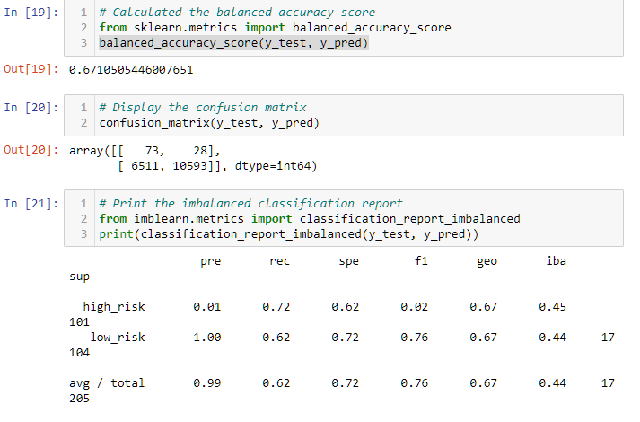

# Credit_Risk_Analysis

## Overview of the Analysis:

The purpose of this module is to train and test various machine learning algorithims to make predictions on data gathered to assess credit risk from loans.  There is a large skew in credit data sets (this one included) with an overwhelming disproportionate amount of loans are considered "good loans" while a insignificate proportion of loans are considered "bad loans". In this analysis we will compare and contrasts six machine learning algorithims and determine the strengths and weakness to each pertaining to this promblem space.

## Results

Below is the accuracy score, confusion matrix and classification report for each of the machine learning models tested.

### Oversampling
1. Oversampling

2. SMOTE

###Undersampling
3. Undersampling
4. SMOTEENN

###Ensemble
5. Balanced Random Forest
6. Easy Ensemble AdaBoost

## Summary